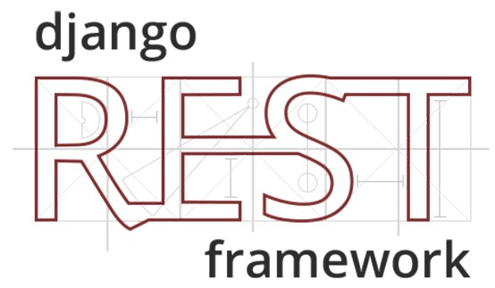

# Daniel Davidraj 

### Have a look 😜
- 🔭 I’m currently working on Full Stack Web Development

- 🌱 I’m currently learning React, Angular

- 💬 Don’t ask me about Theory Classes

- 📫 How to reach me: Just Ping Me😎

- ⚡ Fun fact: Bunk the class, but don't skip the portions 

 

### SkillSet🎓

                                                               

<a href="https://en.wikipedia.org/wiki/CSS">                                                             
  
</a>    
<a href="https://www.javascript.com/">                                                              
  
</a>   

<a href="https://getbootstrap.com/">                                                               
  
</a>
<a href="https://www.php.net/">                                                                  
  
</a>
                                                                                              

<a href="https://www.postgresql.org/">                                                                 
  
</a>                                                                   
<a href="https://redis.io/">                                                                      
  
</a> 
<a href="https://www.sqlite.org/index.html">                                                                      
  
</a>

<a href="https://cloud.google.com/">                                                                
  
</a>
<a href="https://analytics.google.com/">                                                                
  
</a> 

                                          

**** | **Tools**
--- | ---
**Programming Language** |        
**Databases** | 
**Frameworks & Libraries** |      
**Toolkits & Platforms** |     
**Cloud Services** |  
**Design & Prototype** |  

### Connect with me ♥️😼

