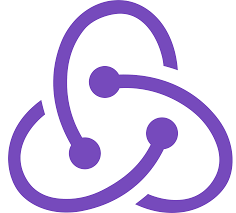

# Daniel Davidraj 

### Have a look
- 🔭 I’m currently working on Full Stack Web Development

- 🌱 I’m currently learning Machine Learning

- ⚡ Fun fact: Bunk the class, but don't skip the portions 

 

### SkillSet🎓
                                    
| | **Tools** |
| --- | --- |
| **Languages** |  |
| **FrontEnd** |  |
| **Databases** |  |
**Frameworks** |  |
**Libraries** |  |
**Toolkits** |  |
**Cloud Services** |  |
**Platforms** |  |

### Connect with me ♥️😼

